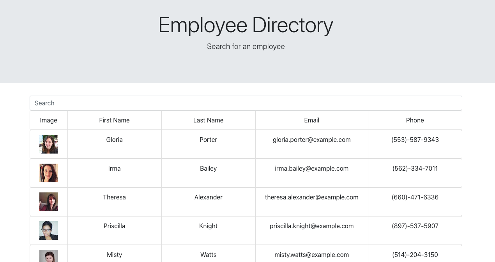

 # Employee Directory
  
  
 
  By: Katie Reid-Anderson

  
  ## Description
  This project uses React components to search employee names in the directory. It allows the user to sort employees by first or last name and also filters employees out upon a search in the searchbar.
  
  ## Table of Contents
  1. [Description](#Description)
  2. [Process](#Process)
  3. [Issues](#Issues)
  4. [Questions](#Questions)

  
  ## Process
  The process of this project was to grab the API data and pass it through a map which would show all of the employee data. Then, you have to grab the information being typed into the searchbard and place it in various arrays depending on the request - ie. if they are searching for a first name, it will filter by the first name of every employee.
  
  ## Issues
  One of the issues along the way is that for some reason, the searchbar will only accept capital letters for first names (because it's looking for an exact match) I wasn't sure where to put toLowerCase() in the code in order to fix this issue.

   ## Questions?
  - Link to the repository: https://github.com/kreidanderson/employee_directory
  - Link to my GitHub Profile: https://github.com/kreidanderson/

